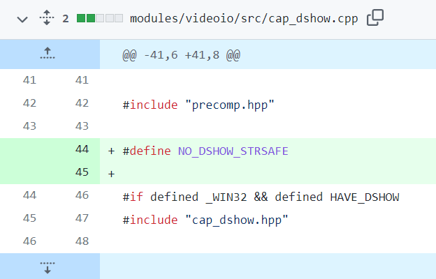

# How to build

部分国家用户建议使用代理，非正常网络环境可能导致错误。

#### Preparation

Get `MinGW-W64` from https://sourceforge.net/projects/mingw-w64/files/. 
Select the version you need. Download, unzip and add `mingw64/bin/` to PATH.

Get `CMake` from https://cmake.org/download/. 

#### Clone and Modify

Fork [OpenCV](https://github.com/opencv/opencv) and clone it. 
Fallback to the commit of the release.

```sh
git reset --hard b0dc474160e389b9c9045da5db49d03ae17c6a6b
```

Add a line

```cpp
#define NO_DSHOW_STRSAFE
```

to `modules/videoio/src/cap_dshow.cpp`.




#### Configure and Generate

Open `cmake-gui.exe`, choose where your source code is and where to build the binaries.

Click `Configure`.

Choose `MinGW Makefiles`, `Use default native compilers`.


Click `Finish` and wait a while.

Check

```sh
ENABLE_CXX11
BUILD_opencv_world
```

and uncheck

```sh
ENABLE_PRECOMPILED_HEADERS
WITH_MSMF
```

if exists.


Click `Generate` and wait a while.

#### Build

Open console and `cd` to build folder.

Choose the number of threads according to your computer's performance.

```sh
mingw32-make -j 32
```

Wait a while depending on your computer's performance. 
When it finishes executing, you will get all the required `.a` and `.dll` files.

If you want the cpp headers folder, you will also need to execute

```sh
mingw32-make install
```

at the end of the previous command.
